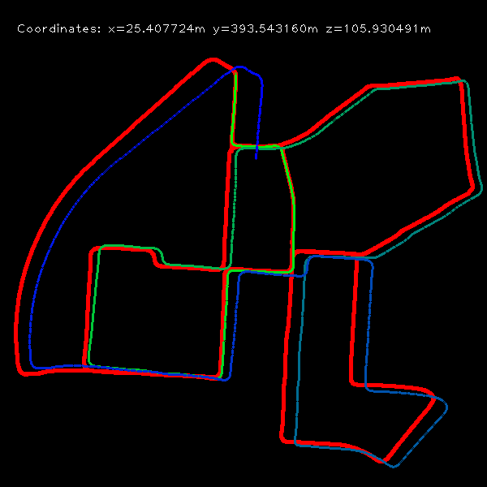

**Keywords:** FAST Feature Detection, LK Feature Tracking, Five-Point Motion Estimation



### Requirements
* Python 2.7
* Numpy
* OpenCV

### Usage
Modify the path in test.py to your image sequences and ground truth trajectories, then run
```
python test.py
```
